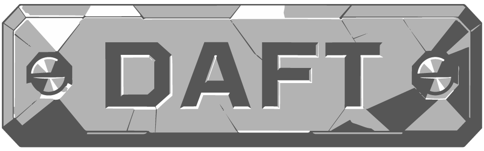
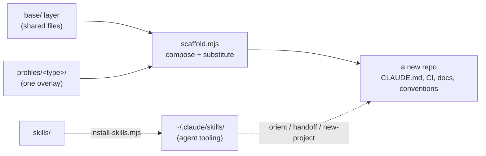

<p align="center">
  
</p>


Daft Plate is type-aware repository scaffolding, agent skills, and context-budget discipline for a solo, AI-heavy development workflow.

> **This is a curated export of a private working repo.** It is published one-directionally by `scripts/publish.mjs` — a fix made here is not upstreamed, and the working history, design documents, and issue history stay private. What you see is the code, the standards, the tests, and a curated account of how it was built.

## What it is

daftplate is the single source of truth that produces other repositories. A new project is not hand-assembled — it is *composed*: a shared `base/` layer plus one `profiles/<type>/` overlay for the project's kind, substituted into a ready-to-work repo with its conventions, CI, and agent instructions already in place. Alongside the templates it ships a set of small agent **skills** (installed into the AI assistant, reusable in any repo) and a hard rule that every plan is phased to fit inside a fixed context budget.

Three things live here, and only here:

1. **Engineering standards** — `engineering-standards/`, the canonical conventions every other repo *points at* and never copies (ADR 0001).
2. **Repo templates** — a `base/` layer plus eight `profiles/<type>/` overlays, composed by `scripts/scaffold.mjs` and the `/new-project` skill.
3. **Agent skills** — `skills/`, installed to `~/.claude/skills/` by `scripts/install-skills.mjs`.

## How it composes



A profile only ever *differs* from base: `files/` adds, `files-override/` replaces (and must say why). A silent collision is a hard error, not a wrong repo with a passing check. Every scaffolded repo carries a `.daftplate.json` provenance record, so a later standards change can be propagated without a three-way merge (ADR 0003).

## Profiles

`gas-webapp` · `web-app` · `userscript` · `local-tool` · `design-vault` · `content-library` · `office-automation` · `app-monolith`

Each targets a real project shape — a Google Apps Script app, an edge-hosted site, a large single-file userscript, a zero-dependency CLI, an Obsidian-style design vault, a validated content library, an Excel/VBA workbook set, and an implemented TypeScript-service-plus-database monolith with its own architecture-doc skill suite.

## Quick start

```
npm test                              # verify the tooling (node:test, zero dependencies)
node scripts/verify-templates.mjs .   # verify base + every profile is well-formed
node scripts/install-skills.mjs       # install the agent skills to ~/.claude/skills
```

## Docs

- [Introduction](docs/introduction.md) — the non-technical story
- [Setup guide](docs/setup-guide.md) — prerequisites, installing the skills, the statusline
- [Workflow guide](docs/workflow-guide.md) — new projects, daily sessions, context-budgeted planning, tracking issues on a Linear board, and shipping
- [Architecture](docs/architecture.md) — layer composition, skill internals, extending the system
- [Skill reference](docs/skill-reference.md) — every skill: purpose, invocation, inputs/outputs, failure modes
- [Development history](docs/development-history.md) — how it was built, phase by phase
- [Decision log](docs/decision-log.md) — the architectural decisions and their reasoning

## License

MIT — see [LICENSE](LICENSE).
