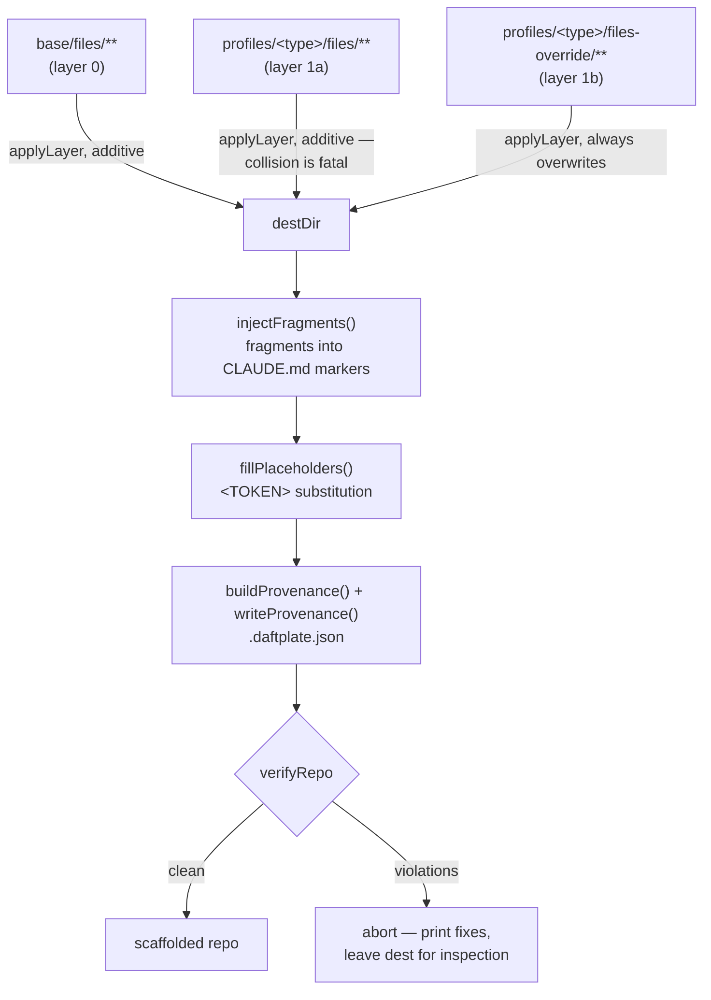

# Architecture

`daftplate` composes a new repository from ordered layers, verifies the result against a written contract, records what it wrote, and ships the skills that keep a repo working once it exists. This document is the technical reference: layer composition, scaffolding internals, verification, provenance, the skill system, publication, and how to add a new profile.

## Layer composition

A scaffolded repo is the deterministic sum of four layers, applied in order:

```
base/files/**                      layer 0 — every repo gets this
profiles/<type>/files/**           layer 1a — additive overlay
profiles/<type>/files-override/**  layer 1b — declared replacements of base files
substitution                       layer 2 — fragments into CLAUDE.md markers, <TOKENS> filled
```

`scripts/apply-layer.mjs` performs one layer copy at a time; `scripts/scaffold.mjs` (below) calls it twice — once for `base/`, once for the profile directory — into the same destination. Its rules, applied recursively at every depth via `collect()`:

| Stored as | Becomes | Why |
|---|---|---|
| `dot-<name>` (file or directory) | `.<name>` | so template dotfiles never take effect inside this repo |
| `gitignore-append` | appended to the destination `.gitignore` | profiles extend, rather than replace, the base ignore list |
| anything under `files-override/` | overwrites the base file | the only sanctioned way for a profile to replace base content |

Two things about that table are stricter than they look. `targetName()` matches on the literal, un-renamed name (`dot-` is stripped only for the *destination* path, so a nested `files/dot-claude/skills/foo/SKILL.md` still lands at `.claude/skills/foo/SKILL.md`), and the `gitignore-append` filename is matched wherever it appears in the tree, but it always appends to a single top-level `.gitignore` — its own position in the source tree is irrelevant. `files-override/` entries are never checked against `files/` for the same layer; they exist expressly to overwrite whatever `base/` wrote and are applied unconditionally.

A collision between `files/` and an existing destination file is a **hard error**: `apply-layer.mjs`'s own `--strict` flag turns a collision into a non-zero exit when it is run standalone, and `scaffold.mjs` enforces the same rule unconditionally in code — a profile that writes a path `base/` already wrote fails the scaffold outright, with no flag needed, because `/new-project` must never silently produce a broken repo. Silent skips were the original failure mode: a profile file that quietly lost to base produced a wrong repo with a passing verifier. The fix is not a warning; it is `overlay.skipped.length` throwing, with the message pointing at `files-override/` as the sanctioned escape hatch.



## Scaffolding

`scripts/scaffold.mjs` is the single function both `/new-project` and the E2E test suite call. Given `(templatesRoot, type, destDir, values)` it:

1. Resolves `profiles/<type>/profile.md` and reads its fenced ` ```profile ` metadata block via `parseProfileMeta` (shared with `verify-templates.mjs` — one parser, one source of truth for `verify`, `test`, `deploy`, `docs-subdirs`).
2. Applies `base/` into `destDir`, then applies the profile directory on top. Any profile/base path collision raises immediately (see above).
3. **Injects the three profile fragments.** `injectFragments()` walks a fixed marker table:

   | Marker in `CLAUDE.md` | Sourced from |
   |---|---|
   | `<!-- profile:constraints -->` | `claude-md-fragment.md` |
   | `<!-- profile:routing -->` | `skill-routing.md` |
   | `<!-- profile:context -->` | `context-rules.md` |

   A marker present in `CLAUDE.md` with no corresponding profile file is a thrown error (`profile is missing <file>, required by <marker>`) — a profile cannot ship a `CLAUDE.md` marker it doesn't intend to fill. A marker the base `CLAUDE.md` doesn't contain is simply skipped, so a profile is never forced to use all three.
4. **Substitutes `<TOKEN>`s.** `fillPlaceholders()` walks every text file in the destination (matched by extension or a leading-dot/no-extension heuristic in `textFiles()`) and replaces `<[A-Z][A-Z_]{2,}>` in one `String.replace` pass. `YEAR`, `VERIFY_COMMAND`, `TEST_COMMAND`, `DEPLOY_COMMAND` come from the profile metadata just parsed; `PROJECT_NAME` and `PROJECT_SUMMARY` come from the CLI's `--name`/`--summary`. Because it is one pass with no re-scan of replacement text, a metadata *value* that itself contains a `<TOKEN>`-shaped string would survive into the scaffolded repo unresolved — `verify-templates.mjs`'s `metaValueIssues()` checks for exactly that (`profile-metadata-token`) so it's caught at the template-authoring stage, not discovered in a generated repo.
5. **Records provenance** — after substitution, before verification, so the digests describe the file as it will be committed and the verifier sees the finished tree (see Provenance, below).
6. **Verifies.** `verifyRepo(destDir, { docsSubdirs: meta.docsSubdirs })` runs the full repo-standards check (see Verification, below) and the result is returned to the caller; `scaffold.mjs`'s CLI prints each violation and exits 1 with a `Remove-Item -Recurse -Force` cleanup hint rather than leaving a half-verified repo that looks done.

The composed `CLAUDE.md` — base skeleton plus three injected fragments plus filled tokens — **must stay ≤60 lines**. That ceiling is enforced by `verify-repo.mjs`'s `checkClaudeMdLength()` (default max 60) and is a design constraint on profile authors, not just a check: `CLAUDE.md` is a router to `docs/`, not a place to inline policy, and every profile fragment competes for the same 60-line budget as the base skeleton.

## Verification

Two independent checkers answer two different questions, and neither substitutes for the other:

| Script | Answers |
|---|---|
| `scripts/verify-templates.mjs <root>` | Are `base/` and every profile complete and well-formed? |
| `scripts/verify-repo.mjs <repo>` | Does a repo (usually a fresh scaffold) satisfy `repo-standards.md`? |
| `scripts/scaffold.mjs` | Composes the layers and substitutes; the E2E tests run it end to end |
| `scripts/setup-repo.mjs <repo> [--check]` | Is this repo bootstrapped? Installs the gitleaks hook; `--check` is a read-only doctor that runs against any repo |

**`verify-templates.mjs`** is the template-authoring contract, run against the daftplate repo itself (its argument is the templates root, not a scaffolded repo):

- `checkBase()` — every path in `REQUIRED_BASE_FILES` (root docs, `.github` templates, the CI workflow, `dependabot.yml`, `dot-claude/settings.json`, `orient-hook.mjs`, `question-gate.mjs`, `docs/architecture.md`, `docs/quick-ref-workflow.md`, …) must exist and be non-empty, and `base/files/CLAUDE.md` must contain all three `CLAUDE_MD_MARKERS`. The array is the count; this prose deliberately does not restate it, having already drifted two entries behind it once.
- `checkProfiles()` — for every directory under `profiles/`: the name must be lowercase-kebab; `profile.md`, `claude-md-fragment.md`, `skill-routing.md`, `context-rules.md` must all exist, be non-empty, and (for the two that require it) contain their required headings — `skill-routing.md` needs `## Pipeline` and `## Off`, `context-rules.md` needs `## Context budget` and `## Subagent defaults`. `profile.md` must parse a ` ```profile ` block with all of `REQUIRED_META_KEYS` (`verify`, `test`, `deploy`, `docs-subdirs`).
- **Metadata hygiene**, via `metaValueIssues()` — three checks that exist because a bad metadata value only fails loudly once it's inside a generated repo, which is too late: a `<TOKEN>`-shaped value would survive substitution unresolved (`profile-metadata-token`); `test: node --test <path>` is silently broken on Node 22+, where a bare directory or glob argument to `--test` matches nothing (`profile-metadata-test-form` — the only correct value is bare `npm test`, with `package.json` running unadorned `node --test`); and a `verify`/`test`/`deploy` value naming `scripts/<file>` is a promise the profile must keep — a reference to a script the profile doesn't ship under `files/` is `profile-metadata-missing-script`.
- `files-override/` entries are checked against `base/files/` — an override that replaces nothing (no matching base path) is `override-unnecessary`: it belongs in `files/` instead.

**`verify-repo.mjs`** is the contract a scaffolded (or any) repo must satisfy against `repo-standards.md`:

- Required root files present (`README.md`, `LICENSE`, `CHANGELOG.md`, `CLAUDE.md`, `.gitignore`).
- Root and `docs/` file naming is lowercase-kebab, except a fixed allowlist of canonical uppercase names (`README.md`, `LICENSE`, `CONTRIBUTING.md`, etc.).
- `docs/` is flat except for a **docs-subdirs allowlist** — `designs` and `adr` by default, extended per-profile by the `docs-subdirs` metadata key (the `app-monolith` profile, for instance, adds `architecture` and `database` for its C4 views and DBML). A subdirectory not on the list is a `docs-layout` violation.
- `CLAUDE.md` is ≤60 lines (above).
- No `engineering-standards/` directory (`vendored-standards` — standards are canonical in daftplate per ADR 0001, never copied).
- Any gitignored secret config (`.env`, `.clasp.json`, `.dev.vars`) has a committed `.example` twin (`example-twin`).
- No unresolved `<!-- profile:* -->` markers or `<TOKEN>` placeholders anywhere in the tree (`placeholders`) — the definitive check that substitution actually completed.

Both scripts share `scripts/lib/cli.mjs` for argument handling, violation reporting, and exit codes, and both walk the tree via `scripts/lib/fs.mjs`'s `walkFiles()`, which never follows symlinks and skips `.git`, `node_modules`, `dist`, `build`, `coverage`, `.astro`, `.wrangler`, `.next`. Everything is exercised by `npm test` (`node --test`, which discovers `tests/**` from the repo root — a bare directory argument is treated as a glob pattern on Node 22+ and does not resolve, the exact trap `profile-metadata-test-form` guards profiles against).

`verify-repo.mjs` is written for *scaffolded* repos. Run against `daftplate` itself it reports `vendored-standards` (this repo is the canonical home of the standards) and `placeholders` findings from design docs and tests that quote template tokens. Do not add self-exemptions to the checker; the noise is the point.

`tests/scaffold.e2e.test.mjs` scaffolds every profile it discovers under `profiles/` from the real layers on every run and asserts the result is verifier-clean with a `CLAUDE.md` under 60 lines. Reading the directory rather than a hardcoded list means a profile added without a test edit is covered by construction — any layer change that breaks scaffolding fails the suite, and the extension guide below relies on exactly this property.

## Provenance

`scripts/scaffold.mjs` writes `.daftplate.json` into every scaffolded repo, built by `scripts/lib/provenance.mjs`:

```json
{
  "daftplate": "0.1.0",
  "profile": "app-monolith",
  "tokens": { "YEAR": "2026", "PROJECT_NAME": "…", "PROJECT_SUMMARY": "…" },
  "files": {
    "docs/architecture.md": { "digest": "sha256:…", "layer": "base", "mode": "copied" },
    "CLAUDE.md": { "digest": "sha256:…", "layer": "profile", "mode": "overridden" }
  }
}
```

Each entry records a SHA-256 digest (`fileDigest()`, taken *after* substitution — the manifest describes the committed bytes), which layer wrote the file (`base` or `profile`), and how (`copied`, `appended`, or `overridden`). Layer and mode matter because a future sync must never push a base update into a file a profile overrode or merely appended to; the profile layer's record is written second in `scaffold.mjs` so it wins whenever a path appears in both.

Phase 6's `/sync-standards` reads this manifest to distinguish a file the repo edited from a file the template changed since scaffolding — the first is reported and never touched, the second is safe to update in place. ADR 0003 records why this is hand-rolled rather than delegated to `copier`: adopting `copier` would mean re-expressing `base/`/`profiles/` as a Jinja2 tree (retiring `apply-layer.mjs`, `scaffold.mjs`, `verify-templates.mjs`, and a large share of the test suite to buy one feature); `copier` has no equivalent of the two-layer `files/`-additive-vs-`files-override/`-replacement model or of a silent collision being a hard error; and it adds a Python runtime prerequisite for a narrow, already-small propagation surface (standards are never vendored, so the only things a consuming repo needs updated are `docs/quick-ref-workflow.md` and roughly sixteen base-layer files). What `copier` got right — a committed provenance record — is the one idea ADR 0003 adopts as `.daftplate.json`, at a cost of roughly a hundred dependency-free lines against a known manifest.

### Manifest schema versions

The manifest carries a top-level `schema` integer. A manifest written before that field existed has no `schema` key and is **schema 1**; `scaffold.mjs` and enrollment now write **schema 3**, and a schema 2 manifest — written by any daftplate between the `ownership` field's introduction and the `declined` value's — reads unchanged. Readers accept schema 1, 2 and 3, and reading or synchronizing an older manifest requires no migration write. **The number advances when an entry needs a value the current number cannot express — never because a write happened for some other reason**, and never as an upgrade pass over repos that are working. Recording a decline bumps the number because `declined` is illegal below schema 3; a managed update against a schema 1 repo does not, however many files it rewrites, and that repo stays schema 1 indefinitely. The distinction is load-bearing rather than tidy: migrating on the occasion of a write would convert every pre-1.6.0 repo on its next sync, and a daftplate 1.6.0 checkout *refuses* a schema 3 manifest outright, so a repo that worked before the sync would stop working for anyone on an older checkout after it — the schema refusal firing for a migration nobody requested.

**A writer never states a value a reader would supply from its absence.** `validateProvenance()` returns a normalized copy — schema 1's implicit ownership made explicit, a `schema` key supplied where the file had none, an absent `tokens` map read as `{}` — and that copy is a reader's view, never a writer's source. `unnormalizeProvenance()` is the inverse, applied where synchronization writes a manifest it first read, and it is what keeps the file above from declaring one schema while carrying another's shape. Absence *is* schema 1, so schema 1 is the one number a manifest never states; an empty `tokens` map is a default nobody stated; ownership is implicit only under schema 1, so from schema 2 it is content and is written. A non-managed entry under schema 1 is a refusal rather than a strip — schema 1 cannot say `diverged`, and stripping would publish a manifest claiming daftplate owns bytes it does not.

**Missing ownership reads as `managed`, and only under schema 1.** Every schema 1 entry was written by a scaffold, so daftplate produced its bytes and the absent field means exactly that. Schema 2 writes `ownership` explicitly on every entry, so its absence there is a malformed manifest rather than a default: reading it as `managed` would hand daftplate write authority over a path whose author declined to record granting it. An unknown schema version, an unknown `ownership` or `mode` value, or a `diverged` entry missing `templateDigest` is a refusal rather than a degrade — a reader refuses any schema number above the maximum it implements instead of guessing at fields it was not written to understand. These checks live in `scripts/lib/provenance.mjs` so enrollment and synchronization cannot disagree about what a manifest means.

Schema 2 adds a per-entry `ownership: "managed" | "diverged"` beside the digest whose authority it qualifies. `managed` means the normal digest gates may update the path. `diverged` means daftplate has measured the path but does not own its current bytes; such an entry also carries `templateDigest`, so `digest` baselines the repository file and `templateDigest` baselines the composed candidate at enrollment time. `classify()` reports a divergent entry as `DIVERGED / REPORT_ONLY` and `/sync-standards` never writes it. Ownership is orthogonal to `mode`: `copied`, `overridden` and `appended` still answer how the layer system produced the candidate, and a fourth mode would have erased that. ADR 0003's 2026-08-20 amendment records why, along with the enrollment path that creates divergent entries in the first place — for a repo daftplate never scaffolded, measured against the real composition, writing one new `.daftplate.json` and no other file in the target.

**Schema 3 adds a third ownership value, `declined`, legal only from schema 3 onward** — under an older schema the same value is an unknown ownership and refuses, which is the schema bump's entire job: an operator reading "unsupported schema" inspects the right thing (this daftplate's version) instead of a manifest that is in fact correct. A declined entry records that an operator refused a path the template offers; it differs from divergence in the one respect the two cases can differ — the repository need not hold any bytes at all. `templateDigest` is therefore unconditionally required, because there is always a candidate the operator refused, but **`digest` is conditional: its presence is itself the record of whether the path had bytes at decline time**, absent meaning nothing was there and present meaning an unowned file was, with these bytes. `classify()` reports a declined entry as `DECLINED / REPORT_ONLY`. `templateDrift` is the same field, computed the same way, as divergence's — the template-side question is identical in both cases. The repository-side question is not: **divergence always has a `digest` baseline to compare against, and a declined entry may not, so its answer is `repoState` over five values — `ABSENT | APPEARED | UNCHANGED | CHANGED | MISSING`** — rather than divergence's three, because "nothing was ever here" and "the unowned file is unchanged" are different things for an operator to see, and so are "a file appeared" and "the unowned file was edited". The declined gate sits above every managed gate for the same reason the divergent gate does, and a sharper failure mode: with `digest` potentially absent, a fall-through would offer to restore a file the repository never had.

## Skills

`skills/<name>/SKILL.md` in this repo is the source of truth for every **user-level** skill (`/new-project`, `/orient`, `/handoff`, `/brief`, `/code-map`, `/gas-deploy`). `scripts/install-skills.mjs` copies each into `~/.claude/skills/<name>/`, overwriting files in place — it never deletes, because that directory holds every other skill a developer has installed, and an unguarded recursive delete keyed on directory names from this repo is an unacceptable blast radius. Editing the installed copy instead of the source is a bug; edits go to `skills/` and are re-installed.

ADR 0002 explains why these are user-level rather than repo-scoped: a repo-scoped skill only loads when the agent's working directory is that repo, but `/new-project` is invoked from *outside* any repo, precisely because the target repo doesn't exist yet — the same argument applies to `/orient` and the rest, which must work in every repo a developer touches.

**Repo-scoped skills remain valid where a skill only makes sense inside one repo.** The exception ADR 0002 carves out is the `app-monolith` profile's architecture suite, shipped under `profiles/app-monolith/files/dot-claude/skills/` — five skills that land in a scaffolded repo's own `.claude/skills/` via the ordinary base/profile file-copy mechanism (the `dot-claude` → `.claude` rename), not via `install-skills.mjs`, which reads only the daftplate-root `skills/` directory and cannot reach them (a test proves it):

- **`architecture-docs`** — maintains small, linked Mermaid C4 views (`system-context.md`, `containers.md`, `domain-map.md`, and per-container component views only where warranted) under `docs/architecture/`, deliberately with no whole-system master diagram.
- **`domain-module`** — enforces that each bounded domain has a doc (purpose, non-responsibilities, owned tables, public interface, events, dependencies, invariants) and that a domain owns writes to its own tables; a cross-domain write must go through an interface or event, never a direct write.
- **`database-schema`** — migrations and the committed schema are the sole authority; changes are additive and reversible, walked against an eight-item risk checklist (keys, nullability, constraints, indexes, cascades, backfill, concurrency, auditability), with `docs/database/database.dbml` and per-domain ERDs regenerated in the same PR.
- **`feature-flow`** — documents one high-impact, cross-domain, or failure-sensitive operation per file under `docs/architecture/flows/` as a Mermaid sequence or state diagram, covering trigger, state changes tagged by owning domain, transaction boundaries, idempotency, and compensation.
- **`architecture-audit`** — a read-only, pre-ship drift check across the other four: cross-domain writes, unmigrated schema changes, docs that contradict the diff, unrecorded ADR-worthy decisions — reported blocking/recommended/polish, never auto-fixed.

**A skill may bundle a helper script.** Most skills are a single `SKILL.md`, but one that needs deterministic logic which must travel with it ships that logic under its own `skills/<name>/scripts/` — `install-skills.mjs` copies the whole directory recursively, so the helper reaches `~/.claude/skills/<name>/scripts/` and runs standalone. `/diagram` works this way: `skills/diagram/scripts/to-excalidraw.mjs` is a zero-dependency converter that turns a structured model into an editable `.excalidraw` (and Mermaid source), and `scripts/scan-structure.mjs` beside it scans a directory into the `structure` board model (folders as frames, files as cards); both deliberately import nothing from the daftplate root so they function in any repo the skill is installed into.

**Skills split into their own repo, `daftkit`, at Phase 5.** Through Phases 1–3, `/new-project` is a thin wrapper over `scaffold.mjs` and the layers, so every layer-format change touches the skill and the scaffolding code together — splitting early would make the most-churned path a two-repo PR. After Phase 2 the ratio inverts: most user-level skills have no coupling to the templates, this repo's version tags describe scaffolding rather than skill releases, and a public skills repo is the better portfolio artifact than a private templates repo. The trigger to execute the split is mechanical, not calendar-based: skill changes and template changes stop landing in the same PR.

### The session-start hook

`base/files/dot-claude/orient-hook.mjs` lands as `.claude/orient-hook.mjs` in every scaffolded repo and is registered as a `SessionStart` hook by the base layer's `settings.json`. It asks the agent to run `/orient` before spending any context.

Two properties make it safe to ship into repos daftplate does not control:

1. **It probes before it speaks.** `/orient` is installed user-level, but the hook is committed and travels with a clone. On a machine where `install-skills.mjs` was never run the skill is absent, so the probe prints nothing and exits 0 rather than invoking something that does not exist.
2. **It sends one of two payloads.** `/orient` does two jobs — a situational brief that is useful everywhere, and a "never open a file over 50KB" discipline that only matters where such a file exists. The probe walks the repo (~7ms, early exit, excluded dirs skipped) and sends the discipline only when it applies. Teaching the size rule to a repo of 5KB modules costs tokens and trains defensive grepping that is more expensive than the reads it avoids.

The hook cannot branch on the model: Claude Code passes hooks `{session_id, transcript_path, cwd, prompt_id, permission_mode, agent_id, agent_type, effort}` and never the model. It also deliberately does not read its stdin — a blocking read at session start is the failure the probe exists to prevent.

daftplate's own `.claude/settings.json` points at the template source rather than a copied dotfile, because the `dot-` rule means template files never take effect inside this repo.

## Publication

ADR 0004 and ADR 0005 govern how daftplate becomes a public portfolio artifact without exposing the private working repo. The decision, made once Phase 1 had 82 passing tests and the layer/verify/provenance system was shipped, rejects the tempting shortcut — flipping the private repo public — because that carries its full git and issue history, permanently and irreversibly, along with characterizations of unrelated private work that live in earlier design-doc revisions.

**Instead: the private working repo stays private, forever**, and Phase 5 introduces `scripts/publish.mjs` as a **curated export** — it copies an allowlisted set of paths into a separate public repository with fresh history, rather than rewriting the history of the repo of record. The allowlist (ADR 0004) covers `base/`, `profiles/`, `scripts/`, `tests/`, `engineering-standards/`, `workspace/`, a fixed set of portfolio-grade docs (`docs/introduction.md`, `docs/setup-guide.md`, `docs/workflow-guide.md`, `docs/architecture.md`, `docs/skill-reference.md`, `docs/code-map.md`), and the canonical root files. It is allowlist-first — a path not named is not exported, so a new top-level directory defaults to private — with a denylist checked *after*, so a future allowlist widening can never silently pull in `docs/designs/`, `docs/adr/`, `.daftplate/`, or anything naming a private project. Design documents and ADRs never become public; the reasoning behind the system is not part of the portfolio artifact, only the code, the standards, and the docs suite are. `daftkit`'s split (ADR 0002) uses the same script with a narrower allowlist rather than a second mechanism.

ADR 0005 amends that allowlist by exactly two public-safe documents authored specifically for export — `docs/development-history.md` (the phased build narrative and its metrics, written to name no private repo) and `docs/decision-log.md` (a sanitized summary of each ADR's reasoning, with any private-repo detail generalized) — and fixes the export's shape: fresh, **phase-labeled** history, one commit per phase with real messages and its own SemVer tags from its own first commit, never a single squashed dump, because the phased plan → review → implement discipline is itself the strongest portfolio evidence. `publish.mjs` is the single authoritative mechanism for both public exports, superseding ADR 0002's earlier `git filter-repo` phrasing for the `daftkit` split, and it refuses to publish if a content scan finds a known private-repo name in any exported file.

**The GitHub-side settings arrive with the public export.** `setup-repo.mjs --remote` already probes a repo's visibility and plan tier, applies what the tier allows, and reports the rest with a reason and an unblock condition. Verified against the live private repo on 2026-07-22: branch protection and rulesets return 403 on a private repo on the free plan — not a permissions problem, and not available in the Settings UI either — and secret scanning on a private repo needs Advanced Security, which the paid tier in use does not include. So the two items logged "open, needs human" from Phase 0 through Phase 1c were never human-actionable. `repo-standards.md` §2.1 layer 2 anticipated this and named the substitute, which has been shipped and green since Phase 0: the `secrets` CI job running gitleaks over full history. The real settings arrive with the public export in Phase 5, where the same `setup-repo.mjs --remote` code path applies branch protection, rulesets, and secret scanning all unprompted, because a public repo on any plan clears the 403.

## Extension guide

Adding a profile requires no code change, by construction — `scaffold.mjs` and `/new-project` read `profiles/` directory contents rather than a hardcoded list, and `tests/scaffold.e2e.test.mjs` does the same, so a new profile is covered by the existing suite the moment it exists.

1. Create `profiles/<type>/`, named lowercase-kebab (`verify-templates.mjs` enforces this).
2. Write the four required files:
   - **`profile.md`** — a `## When to use` / `## Stack assumptions` narrative, plus a fenced ` ```profile ` metadata block with `verify:`, `test:`, `deploy:`, and `docs-subdirs:` (comma-separated directory names to add to the `docs/` allowlist beyond `designs, adr`). Keep `test:` as bare `npm test` — a positional argument after `--test` is a glob that resolves to nothing on Node 22+.
   - **`claude-md-fragment.md`** — the profile-specific text substituted at `<!-- profile:constraints -->`.
   - **`skill-routing.md`** — must contain `## Pipeline` and `## Off` headings; substituted at `<!-- profile:routing -->`.
   - **`context-rules.md`** — must contain `## Context budget` and `## Subagent defaults` headings; substituted at `<!-- profile:context -->`.
3. Optionally add `files/` (additive) and `files-override/` (declared replacements of specific base paths, each justified in `profile.md`'s `## Overrides` section — `verify-templates.mjs` flags an override that replaces nothing in `base/` as `override-unnecessary`).
4. Run `node scripts/verify-templates.mjs .` — it enforces every constraint above, plus metadata hygiene (no stray `<TOKEN>` inside a metadata value, no missing script reference).
5. Run `npm test` — the E2E suite scaffolds the new profile from the real layers and asserts a verifier-clean result with `CLAUDE.md` ≤60 lines. `/new-project` picks the profile up immediately, with no code change.

Eight profiles exist today as worked examples of the contract: `app-monolith`, `content-library`, `design-vault`, `gas-webapp`, `local-tool`, `office-automation`, `userscript`, and `web-app` — spanning a full client/service/database monolith down to a single-file userscript, all satisfying the same four-file contract and the same verifier.
